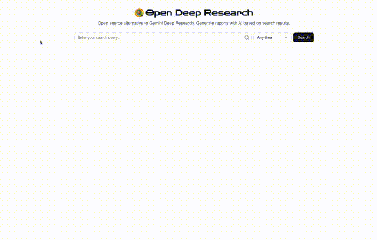

# Open Deep Research

<div align="center">
  
</div>

An open-source alternative to Gemini Deep Research, built to generate AI-powered reports from web search results with precision and efficiency. Supporting multiple AI platforms (Google, OpenAI, Anthropic) and models, it offers flexibility in choosing the right AI model for your research needs.

This app functions in three key steps:

1. **Search Results Retrieval**: Using the Bing Search API, the app fetches comprehensive search results for the specified search term.
2. **Content Extraction**: Leveraging JinaAI, it retrieves and processes the contents of the selected search results, ensuring accurate and relevant information.
3. **Report Generation**: With the curated search results and extracted content, the app generates a detailed report using your chosen AI model (Gemini, GPT-4, Sonnet, etc.), providing insightful and synthesized output tailored to your custom prompts.
4. **Knowledge Base**: Save and access your generated reports in a personal knowledge base for future reference and easy retrieval.

Open Deep Research combines powerful tools to streamline research and report creation in a user-friendly, open-source platform. You can customize the app to your needs (select your preferred AI model, customize prompts, update rate limits, and configure the number of results both fetched and selected).

## Features

- 🔍 Web search with time filtering
- 📄 Content extraction from web pages
- 🤖 Multi-platform AI support (Google Gemini, OpenAI GPT, Anthropic Sonnet)
- 🎯 Flexible model selection with granular configuration
- 📊 Multiple export formats (PDF, Word, Text)
- 🧠 Knowledge Base for saving and accessing past reports
- ⚡ Rate limiting for stability
- 📱 Responsive design

## Demo

Try it out at: [Open Deep Research](https://opendeepresearch.vercel.app/)

### Knowledge Base

The Knowledge Base feature allows you to:

- Save generated reports for future reference (reports are saved in the browser's local storage)
- Access your research history
- Quickly load and review past reports
- Build a personal research library over time

## Configuration

The app's settings can be customized through the configuration file at `lib/config.ts`. Here are the key parameters you can adjust:

### Rate Limits

Control rate limiting and the number of requests allowed per minute for different operations:

```typescript
rateLimits: {
  enabled: true,         // Enable/disable rate limiting (set to false to skip Redis setup)
  search: 5,            // Search requests per minute
  contentFetch: 20,     // Content fetch requests per minute
  reportGeneration: 5,  // Report generation requests per minute
}
```

Note: If you set `enabled: false`, you can run the application without setting up Redis. This is useful for local development or when you don't need rate limiting.

### Search Settings

Customize the search behavior:

```typescript
search: {
  resultsPerPage: 10,           // Number of search results to fetch
  maxSelectableResults: 3,      // Maximum results users can select for reports
  safeSearch: 'Moderate',       // SafeSearch setting ('Off', 'Moderate', 'Strict')
  market: 'en-US',             // Search market/region
}
```

### Knowledge Base

The Knowledge Base feature allows you to build a personal research library by:

- Saving generated reports with their original search queries
- Accessing and loading past reports instantly
- Building a searchable archive of your research
- Maintaining context across research sessions

Reports saved to the Knowledge Base include:

- The full report content with all sections
- Original search query and prompt
- Source URLs and references
- Generation timestamp

You can access your Knowledge Base through the dedicated button in the UI, which opens a sidebar containing all your saved reports.

### AI Platform Settings

Configure which AI platforms and models are available. The app supports multiple AI platforms (Google, OpenAI, Anthropic, DeepSeek) with various models for each platform. You can enable/disable platforms and individual models based on your needs:

```typescript
platforms: {
  google: {
    enabled: true,
    models: {
      'gemini-flash': {
        enabled: true,
        label: 'Gemini Flash',
      },
      'gemini-flash-thinking': {
        enabled: true,
        label: 'Gemini Flash Thinking',
      },
      'gemini-exp': {
        enabled: false,
        label: 'Gemini Exp',
      },
    },
  },
  openai: {
    enabled: true,
    models: {
      'gpt-4o': {
        enabled: false,
        label: 'GPT-4o',
      },
      'o1-mini': {
        enabled: false,
        label: 'o1-mini',
      },
      'o1': {
        enabled: false,
        label: 'o1',
      },
    },
  },
  anthropic: {
    enabled: true,
    models: {
      'sonnet-3.5': {
        enabled: false,
        label: 'Claude 3 Sonnet',
      },
      'haiku-3.5': {
        enabled: false,
        label: 'Claude 3 Haiku',
      },
    },
  },
  deepseek: {
    enabled: true,
    models: {
      'chat': {
        enabled: true,
        label: 'DeepSeek V3',
      },
      'reasoner': {
        enabled: true,
        label: 'DeepSeek R1',
      },
    },
  },
}
```

For each platform:

- `enabled`: Controls whether the platform is available
- For each model:
  - `enabled`: Controls whether the specific model is selectable
  - `label`: The display name shown in the UI

Disabled models will appear grayed out in the UI but remain visible to show all available options. This allows users to see the full range of available models while clearly indicating which ones are currently accessible.

To modify these settings, update the values in `lib/config.ts`. The changes will take effect after restarting the development server.

## Getting Started

### Prerequisites

- Node.js 18+
- npm, yarn, pnpm, or bun

### Installation

1. Clone the repository:

```bash
git clone https://github.com/btahir/open-deep-research
cd open-deep-research
```

2. Install dependencies:

```bash
npm install
# or
yarn install
# or
pnpm install
# or
bun install
```

3. Create a `.env.local` file in the root directory:

```env
# Azure Bing Search API key (required for web search)
AZURE_SUB_KEY=your_azure_subscription_key

# Google Gemini Pro API key (required for AI report generation)
GEMINI_API_KEY=your_gemini_api_key

# OpenAI API key (optional - required only if OpenAI models are enabled)
OPENAI_API_KEY=your_openai_api_key

# Anthropic API key (optional - required only if Anthropic models are enabled)
ANTHROPIC_API_KEY=your_anthropic_api_key

# DeepSeek API key (optional - required only if DeepSeek models are enabled)
DEEPSEEK_API_KEY=your_deepseek_api_key

# Upstash Redis (required for rate limiting)
UPSTASH_REDIS_REST_URL=your_upstash_redis_url
UPSTASH_REDIS_REST_TOKEN=your_upstash_redis_token
```

Note: You only need to provide API keys for the platforms you plan to use. If a platform is enabled in the config but its API key is missing, those models will appear disabled in the UI.

4. Start the development server:

```bash
npm run dev
# or
yarn dev
# or
pnpm dev
# or
bun dev
```

5. Open [http://localhost:3000](http://localhost:3000) in your browser.

### Getting API Keys

#### Azure Bing Search API

1. Go to [Azure Portal](https://portal.azure.com)
2. Create a Bing Search resource
3. Get the subscription key from "Keys and Endpoint"

#### Google Gemini Pro API

1. Visit [Google AI Studio](https://makersuite.google.com/app/apikey)
2. Create an API key
3. Copy the API key

#### OpenAI API Key

1. Visit [OpenAI Platform](https://platform.openai.com)
2. Sign up or log in to your account
3. Go to API Keys section
4. Create a new API key

#### Anthropic API Key

1. Visit [Anthropic Console](https://console.anthropic.com)
2. Sign up or log in to your account
3. Go to API Keys section
4. Create a new API key

#### DeepSeek API Key

1. Visit [DeepSeek Platform](https://platform.deepseek.com)
2. Sign up or log in to your account
3. Go to API Keys section
4. Create a new API key

#### Upstash Redis

1. Sign up at [Upstash](https://upstash.com)
2. Create a new Redis database
3. Copy the REST URL and REST Token

## Tech Stack

- [Next.js 15](https://nextjs.org/) - React framework
- [TypeScript](https://www.typescriptlang.org/) - Type safety
- [Tailwind CSS](https://tailwindcss.com/) - Styling
- [shadcn/ui](https://ui.shadcn.com/) - UI components
- [Google Gemini](https://deepmind.google/technologies/gemini/) - AI model
- [JinaAI](https://jina.ai/) - Content extraction
- [Azure Bing Search](https://www.microsoft.com/en-us/bing/apis/bing-web-search-api) - Web search
- [Upstash Redis](https://upstash.com/) - Rate limiting
- [jsPDF](https://github.com/parallax/jsPDF) & [docx](https://github.com/dolanmiu/docx) - Document generation

## Contributing

Pull requests are welcome. For major changes, please open an issue first to discuss what you would like to change.

## License

[MIT](https://github.com/btahir/open-deep-research/blob/main/LICENSE)

## Acknowledgments

- Inspired by Google's Gemini Deep Research feature
- Built with amazing open source tools and APIs

## Follow Me

If you're interested in following all the random projects I'm working on, you can find me on Twitter:

[](https://x.com/deepwhitman)
