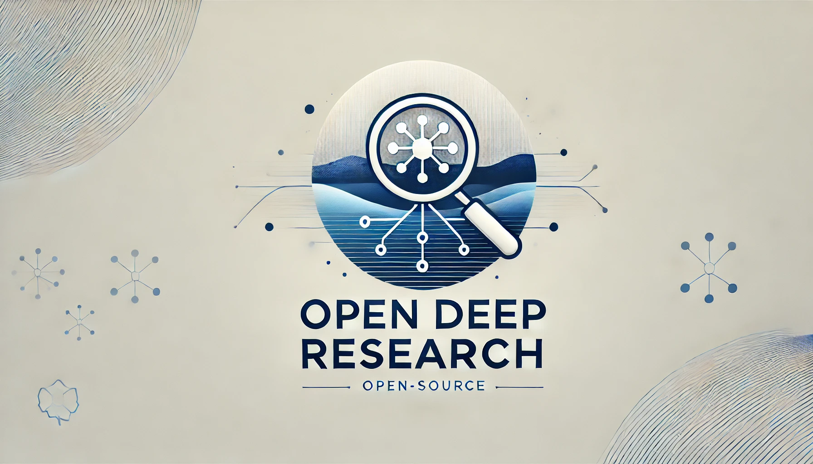

# Open Deep Research

An open source alternative to Gemini Deep Research. Generate AI-powered reports based on web search results.



## Features

- 🔍 Web search with time filtering
- 📄 Content extraction from web pages
- 🤖 AI-powered report generation
- 📊 Multiple export formats (PDF, Word, Text)
- ⚡ Rate limiting for stability
- 📱 Responsive design

## Demo

Try it out at: [demo-url-here](https://your-demo-url.com)

## Getting Started

### Prerequisites

- Node.js 18+ 
- npm, yarn, pnpm, or bun

### Installation

1. Clone the repository:
```bash
git clone https://github.com/yourusername/open-deep-research.git
cd open-deep-research
```

2. Install dependencies:
```bash
npm install
# or
yarn install
# or
pnpm install
# or
bun install
```

3. Create a `.env.local` file in the root directory:
```env
# Azure Bing Search API key (required for web search)
AZURE_SUB_KEY=your_azure_subscription_key

# Google Gemini Pro API key (required for AI report generation)
GEMINI_API_KEY=your_gemini_api_key

# Upstash Redis (required for rate limiting)
UPSTASH_REDIS_REST_URL=your_upstash_redis_url
UPSTASH_REDIS_REST_TOKEN=your_upstash_redis_token
```

4. Start the development server:
```bash
npm run dev
# or
yarn dev
# or
pnpm dev
# or
bun dev
```

5. Open [http://localhost:3000](http://localhost:3000) in your browser.

### Getting API Keys

#### Azure Bing Search API
1. Go to [Azure Portal](https://portal.azure.com)
2. Create a Bing Search resource
3. Get the subscription key from "Keys and Endpoint"

#### Google Gemini Pro API
1. Visit [Google AI Studio](https://makersuite.google.com/app/apikey)
2. Create an API key
3. Copy the API key

#### Upstash Redis
1. Sign up at [Upstash](https://upstash.com)
2. Create a new Redis database
3. Copy the REST URL and REST Token

## Tech Stack

- [Next.js 14](https://nextjs.org/) - React framework
- [TypeScript](https://www.typescriptlang.org/) - Type safety
- [Tailwind CSS](https://tailwindcss.com/) - Styling
- [shadcn/ui](https://ui.shadcn.com/) - UI components
- [Google Gemini Pro](https://deepmind.google/technologies/gemini/) - AI model
- [Azure Bing Search](https://www.microsoft.com/en-us/bing/apis/bing-web-search-api) - Web search
- [Upstash Redis](https://upstash.com/) - Rate limiting
- [jsPDF](https://github.com/parallax/jsPDF) & [docx](https://github.com/dolanmiu/docx) - Document generation

## Rate Limits

- Search: 5 requests per minute
- Content fetching: 10 requests per minute
- Report generation: 3 requests per minute

## Contributing

Pull requests are welcome. For major changes, please open an issue first to discuss what you would like to change.

## License

[MIT](https://choosealicense.com/licenses/mit/)

## Acknowledgments

- Inspired by Google's Gemini Deep Research feature
- Built with amazing open source tools and APIs

## Project Structure

Key files and directories:

```
.
├── app/
│   ├── api/                    # API routes
│   ├── opengraph-image.png    # Social preview image (1200x630px)
│   └── page.tsx               # Main application page
├── components/                # UI components
├── lib/                      # Utility functions and services
└── types/                    # TypeScript type definitions
```
